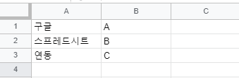
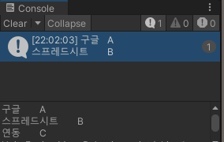

# Google Spread Sheet 연동

유니티에 Google Spread Sheet를 연동하여 사용하는 방법을 알아보았다.

## URL 링크 이용

### 탭으로 구분된 값 불러오기 (tsv)

유니티에서 구글 시트를 이용하기 위해서 탭으로 구분된 값을 다운로드 하여 사용한다.  
<br>  
스프레드시트를 `링크가 있는 모든 사용자에게 공개` 로 전환한 후 URL을 가져온다.  
가져온 URL의 끝 부분을 `/edit#gid=0` 대신 `/export?format=tsv`를 붙여준다.  
<br>
예를들어서,  
작성중인 스프레드시트의 URL이 `https://docs.google.com/spreadsheets/d/19fzcMGoB2JWbW75trJCH1G10k4Ffxgl6rW3LXio22X4/edit#gid=0` 인 경우  
`https://docs.google.com/spreadsheets/d/19fzcMGoB2JWbW75trJCH1G10k4Ffxgl6rW3LXio22X4/export?format=tsv` 를 가져온다.  
<br>
이러면 해당 URL은 탭으로 구분된 값을 다운로드 하게 되는 URL이 된다.
아래 코드는 GET 방식과 POST 방식중 GET 방식의 코드이다. 

```C#
    const string URL = "https://docs.google.com/spreadsheets/d/19fzcMGoB2JWbW75trJCH1G10k4Ffxgl6rW3LXio22X4/export?format=tsv";

    IEnumerator Start()
    {
        UnityWebRequest www = UnityWebRequest.Get(URL);
        yield return www.SendWebRequest();

        string data = www.downloadHandler.text;
        print(data);
    }
```


* SpreadSheet 내용 불러오기 성공!

### 원하는 범위의 값 불러오기

`탭으로 구분된 값 불러오기` 에서 사용한 URL의 끝부분에 범위를 지정한다.  
예를들어서, A2 셀에서 B4 셀 까지만 불러오고 싶은 경우  
URL의 끝부분에 `&range=A2:B4`를 입력한다.  
`https://docs.google.com/spreadsheets/d/19fzcMGoB2JWbW75trJCH1G10k4Ffxgl6rW3LXio22X4/export?format=tsv&range=A2:B4`

## SpreadSheet의 스크립트 편집기 이용

### Script 이용

스크립트를 통해 sheet에 접근하려고 하는 경우 작업중인 시트의 ID를 가져온다.
작업중인 시트의 URL이 `https://docs.google.com/spreadsheets/d/19fzcMGoB2JWbW75trJCH1G10k4Ffxgl6rW3LXio22X4/edit#gid=0` 인 경우
ID는 `19fzcMGoB2JWbW75trJCH1G10k4Ffxgl6rW3LXio22X4` 에 해당한다.

```gs
var sheetId = SpreadsheetApp.openById("19fzcMGoB2JWbW75trJCH1G10k4Ffxgl6rW3LXio22X4");
var sheet = sheetId.getSheets()[0];     //0번째 시트의 정보를 얻는다.

function myFunction()
{
    sheet.getRange(2, 2).setValue("test");  //2행 3열에 값 삽입
}
```


### [참고 링크]

* https://www.youtube.com/watch?v=3LxaTtLsC-w
