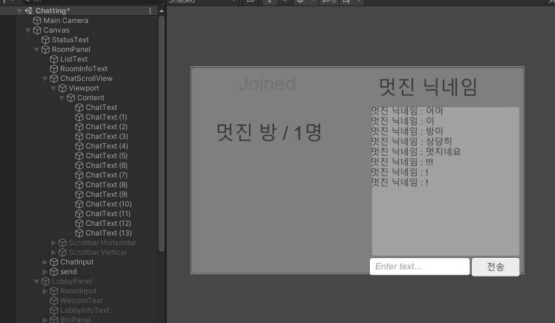

# [Photon Pun2 를 이용한 멀티게임 구현]

멀티게임을 쉽게 구현할 수 있도록 해주는 프레임워크이다.

## [NetworkManager]

빈 오브젝트에 NetworkManager 라는 스크립트를 만들어서 서버와 동작하는 기능을 구현해 놓는다.

사용 예시) 버튼을 NetworkManager와 연결하여 해당 버튼을 누르면 원하는 기능을 수행하도록 한다.

## [NetworkManager 스크립트]

```C#
using Photon.Pun;
using Photon.Realtime;
```
* 위의 두가지를 using 해야 한다.  

`public class NetworkManager : MonoBehaviourPunCallbacks`

* 일반적인 클래스와 다르게 MonoBehaviour을 상속받지 않고 MonoBehaviourPunCallbacks를 상속받는다.  


`void Awake() => Screen.SetResolution(960, 540, false);`
* (PC에서) 빌드하기 위한 화면 크기 설정


`void Update() => StatusText.text = PhotonNetwork.NetworkClientState.ToString();`
* 현재 연결상태를 Text로 표현하는 코드
* 연결상태를 Update()에서 구현하여 실시간으로 연결상태를 확인할 수 있도록 한다.

### [서버 연결]

```C#
    public void Connect() => PhotonNetwork.ConnectUsingSettings();

    public override void OnConnectedToMaster()
    {
        print("서버접속완료");
        PhotonNetwork.LocalPlayer.NickName = NickNameInput.text;
    }
```
* 서버에 접속한다.
* Connect() 메서드가 호출이 완료되면 OnConnectToMaster() 메서드를 콜백하여 서버접속이 완료되었음을 보고받는다.

```C#
    public void Disconnect() => PhotonNetwork.Disconnect();

    public override void OnDisconnected(DisconnectCause cause) => print("연결끊김");
```
* 서버와 연결을 해제한다.
* 연결 해제 후 OnDisconnected함수를 콜백하여 서버접속이 끊겼음을 보고받는다.

### [로비/방 연결]

```C#
    //로비 연결
    public void JoinLobby() => PhotonNetwork.JoinLobby();

    //방만들기 : 방 이름, 최대 플레이어 수를 매개변수로 받는다.
    public void CreateRoom() => PhotonNetwork.CreateRoom(roomInput.text, new RoomOptions { MaxPlayers = 2 });

    //방 참가 : 방 이름을 매개변수로 받는다.
    public void JoinRoom() => PhotonNetwork.JoinRoom(roomInput.text);
    
    //roomInput.text에 해당하는 방이 있을 경우 참가, 없을경우 만들기
    public void JoinOrCreateRoom() => PhotonNetwork.JoinOrCreateRoom(roomInput.text, new RoomOptions { MaxPlayers = 2 }, null);
    
    //랜덤 방 참가
    public void JoinRandomRoom() => PhotonNetwork.JoinRandomRoom();

    //방 나가기
    public void LeaveRoom() => PhotonNetwork.LeaveRoom();

    //콜백 함수들
    public override void OnJoinedLobby() => print("로비접속완료");
    public override void OnCreatedRoom() => print("방만들기완료");
    public override void OnJoinedRoom() => print("방참가완료");
    public override void OnCreateRoomFailed(short returnCode, string message) => print("방만들기실패");
    public override void OnJoinRoomFailed(short returnCode, string message) => print("방참가실패");
    public override void OnJoinRandomFailed(short returnCode, string message) => print("방랜덤참가실패");
```
* 방을 만들기나 참가는 ConnectedToMaster 또는 JoinedLobby 되었을때만 가능하다.


### [PV.RPC] [채팅방 구현]

#### [PV.RPC]
`PV.RPC(string methodName, RPCtarget target, params object[] parameters);`  
`PV.RPC("ChatRPC", RpcTarget.All, "<color=yellow>" + newPlayer.NickName + "님이 참가하셨습니다.</color>");`
* 반드시 Room에 있어야 호출 가능한 함수이다.
* 방에 있는 플레이어에게 메서드를 호출하도록 전달한다.

#### [채팅방 구현]
PV.RPC의 사용 예시를 설명하기 위해 채팅방 구현에 적용한다.

채팅방 UI  
  
* ScrollView 내부에 여러개의 Text를 배치한다.
* Input Field 와 Button을 배치하여 입력과 전송에 이용하도록 한다.

채팅창은 방을 참가할때마다 깨끗하게 비워주도록 한다.  
방에 플레이어가 입장/퇴장 하는 경우, 새로운 방에 입장하게 되는 경우 방 정보를 갱신한다.

```C#
    public override void OnJoinedRoom()     //방에 참가했을때 호출된다.
    {
        //화면전환
        RoomPanel.SetActive(true);
        LobbyPanel.SetActive(false);

        //방 갱신, 채팅창 정리
        RoomRenewal();
        ChatInput.text = "";
        for (int i = 0; i < ChatText.Length; i++) ChatText[i].text = "";
    }

    public override void OnPlayerEnteredRoom(Player newPlayer)      //방에 플레이어가 입장했을때 호출된다.
    {
        RoomRenewal();
        PV.RPC("ChatRPC", RpcTarget.All, "<color=yellow>" + newPlayer.NickName + "님이 참가</color>");
    }

    public override void OnPlayerLeftRoom(Player otherPlayer)       //방에 플레이어가 퇴장했을때 호출된다.
    {
        RoomRenewal();
        ChatRPC("<color=yellow>" + otherPlayer.NickName + "님이 퇴장하셨습니다</color>");
    }

    void RoomRenewal()  //방을 갱신하는 함수 : 참가자의 명단을 갱신한다.
    {
        ListText.text = "";
        for (int i = 0; i < PhotonNetwork.PlayerList.Length; i++)
            ListText.text += PhotonNetwork.PlayerList[i].NickName + ((i + 1 == PhotonNetwork.PlayerList.Length) ? "" : ", ");
        RoomInfoText.text = PhotonNetwork.CurrentRoom.Name + " / " + PhotonNetwork.CurrentRoom.PlayerCount + "명 / " + PhotonNetwork.CurrentRoom.MaxPlayers + "최대";
    }
 ```

## [다양한 코드들]

- `PhotonNetwork.AutomaticallySyncScene = true;` //자동으로 모든 사람들의 scene을 통일 시켜준다. 
- `PhotonNetwork.NickName = "Player " + Random.Range(0, 1000).ToString("0000");` //들어온사람 이름 랜덤으로 숫자붙여서 정해주기
- `text.text = PhotonNetwork.CurrentRoom.Name;` //들어간 방 이름표시
- `Player[] players = PhotonNetwork.PlayerList;` //포톤의 플레이어 리스트 
- `PhotonNetwork.IsMasterClient;` //마스터 클라이언트인 경우 true값 return
- `public override void OnMasterClientSwitched(Player newMasterClient) {}` //방장이 나가서 방장이 바뀌었을때 호출되는 callback함수
- `RoomInfo info;` //포톤 리얼타임의 방정보
- `PhotonNetwork.AutomaticallySyncScene = true;` //scene 동기화 설정 (마스터 클라이언트가 LoadLevel()로 이동시 해당 scene으로 같이 이동)
- `PhotonNetwork.LoadLevel(3);` //3번 씬으로 이동
### [참고링크]
* https://www.youtube.com/watch?v=mPCNTi3Booo&list=PL3KKSXoBRRW3YE4UMnRH762vOhSHLdnpK&index=1&t=2s
* https://www.youtube.com/watch?v=a6MquH2NPRE&list=PL3KKSXoBRRW3YE4UMnRH762vOhSHLdnpK&index=2
* https://wikidocs.net/book/5575
* https://icechou.tistory.com/305?category=296908 